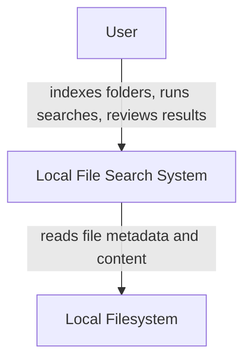
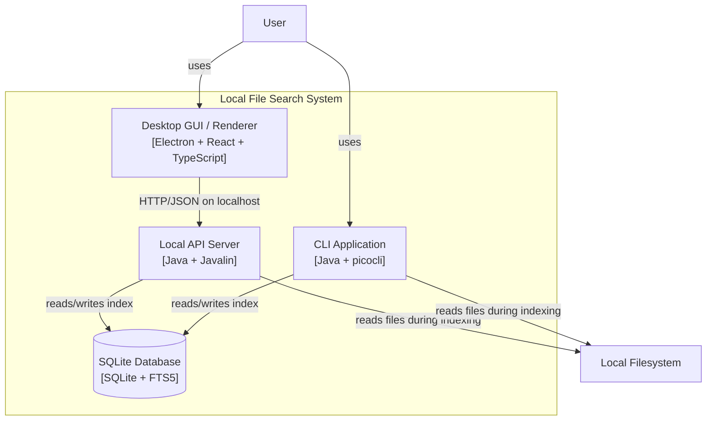
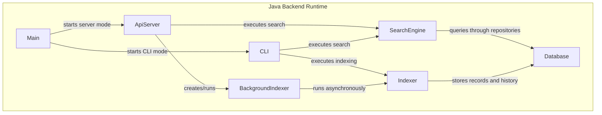
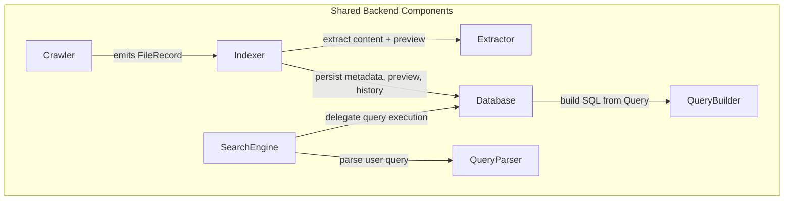
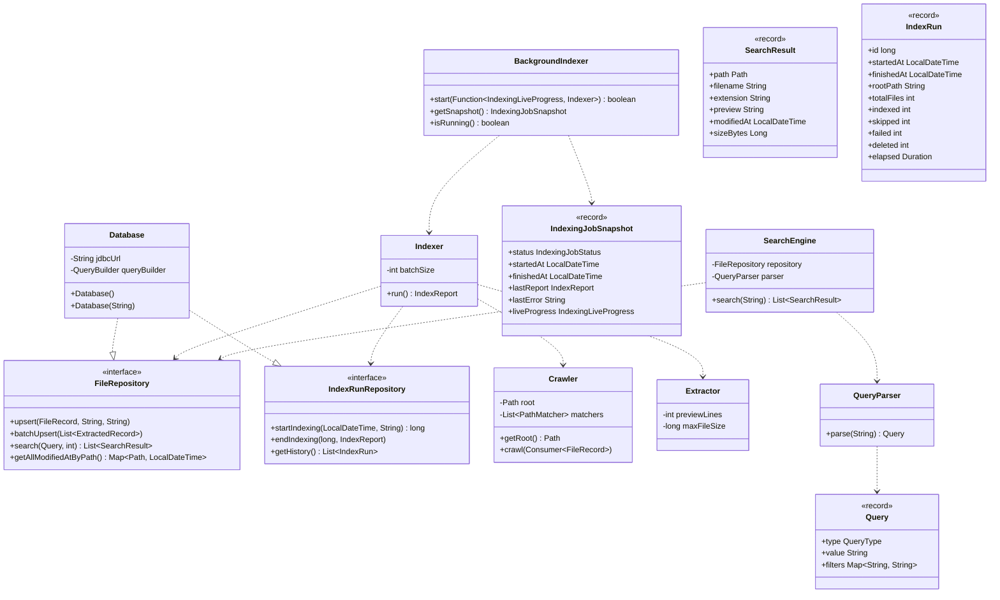
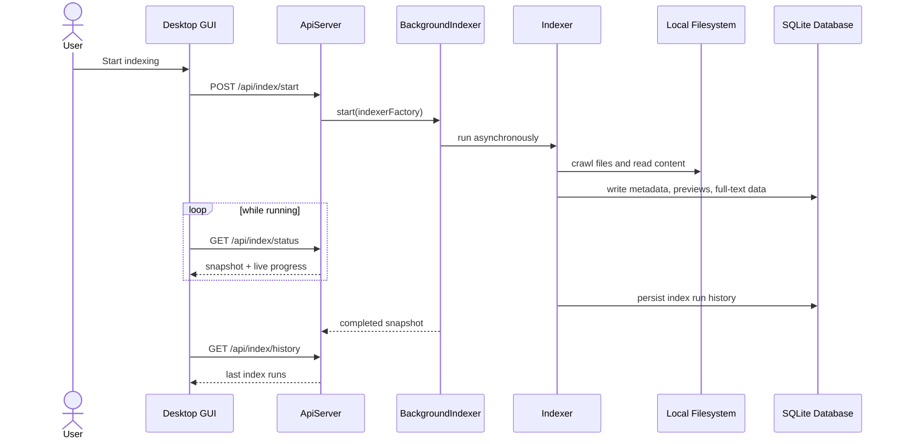
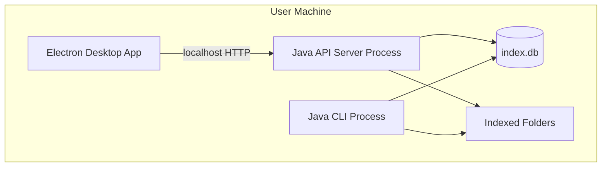

# Local File Search System Architecture

This document presents the architecture of the Local File Search System using the C4 model.  

## Scope And Notation

- **System**: the Local File Search System as a whole
- **Container**: a separately executable unit or persistent data store
- **Component**: a major building block inside a container or shared runtime
- **Class**: selected code-level structures used to illustrate the design

Legend:
- boxes = software systems / containers / components
- cylinders = persistent data stores
- arrows = main communication or dependency direction

---

## 1. System Context (Level 1)

At the highest level, the system enables a user to index a local folder and search its contents and metadata efficiently on their own machine.

### Context Summary

| Entity | Role |
|---|---|
| `User` | Starts indexing, configures options, runs queries, inspects results |
| `Local File Search System` | Crawls files, extracts searchable content, stores indexes, serves searches |
| `Local Filesystem` | External source of files, paths, timestamps, and contents |

---

## 2. Containers (Level 2)

The system is composed of a small number of local containers. The most important boundary at this level is between user-facing clients and the Java backend services that execute indexing and search logic.

### Container Responsibilities

| Container | Technology | Responsibility |
|---|---|---|
| `Desktop GUI / Renderer` | Electron + React + TypeScript | Presents indexing and search screens, calls the local API, renders progress and results |
| `Local API Server` | Java + Javalin | Exposes endpoints for indexing, indexing status/history, and search |
| `CLI Application` | Java + picocli | Provides command-line indexing and search without the GUI |
| `SQLite Database` | SQLite with FTS5 | Stores file metadata, searchable text, previews, and index run history |

### Why this structure?

- The GUI can evolve independently from the indexing and search logic.
- The CLI and API server reuse the same domain logic instead of duplicating it.
- SQLite is an implementation detail hidden behind repository interfaces and query-building code.
- A future web frontend or different client could reuse the existing local API without changing the indexing internals.

---

## 3. Components (Level 3)

The following diagrams show the component structure from two complementary perspectives: orchestration and domain flow.

### 3.1 Backend Orchestration View

### 3.2 Indexing And Search Flow View

### Component Responsibilities

| Component | Responsibility |
|---|---|
| `Main` | Chooses entry mode: local API server or CLI |
| `ApiServer` | Defines REST endpoints, validates request data, maps JSON to backend calls |
| `CLI` | Parses commands/options and invokes backend operations directly |
| `BackgroundIndexer` | Runs indexing asynchronously and exposes job snapshots for polling |
| `Crawler` | Walks the local directory tree and produces `FileRecord` metadata |
| `Extractor` | Reads file content and generates stored preview snippets |
| `Indexer` | Coordinates incremental indexing, batching, deletion handling, and run statistics |
| `SearchEngine` | Converts user input into a query and retrieves matching results |
| `QueryParser` | Interprets query syntax such as text terms and metadata filters |
| `Database` | Central persistence component; implements file and index-run repositories |
| `QueryBuilder` | Converts parsed queries into SQLite/FTS SQL |

---

## 4. Classes (Level 4)

The following class diagram focuses on the most important code-level relationships rather than attempting to show every class in the codebase.

### Important Domain Records

| Type | Purpose |
|---|---|
| `FileRecord` | File metadata discovered during crawling |
| `ExtractedRecord` | File metadata plus extracted content and preview |
| `SearchResult` | DTO returned by CLI/API search operations |
| `IndexReport` | Summary of a completed indexing execution |
| `IndexRun` | Persisted historical record of a past indexing run |
| `IndexingJobSnapshot` | Current or last-known background indexing state for the GUI |

---

## Runtime View

The runtime behavior of indexing is important because the GUI should not block during a long-running indexing operation; instead, it polls live state from the backend.

---

## Deployment View

Although the system is local-first, it still has a meaningful deployment structure.

Observations:
- The desktop app and API server are deployed separately even when started on the same machine.
- The database is embedded and local, which simplifies setup and removes the need for an external database server.
- The filesystem is not owned by the system; it is an external dependency that the system reads.

---

## Key Architectural Decisions

- **Local-first architecture**: all essential functionality runs on the user machine without remote infrastructure.
- **Two clients, one backend core**: the CLI and GUI both reuse the same Java domain logic.
- **API boundary for the GUI**: the frontend depends on stable HTTP endpoints rather than directly invoking Java code.
- **SQLite + FTS5**: appropriate for local full-text search because it has a low setup cost and portable persistence.
- **Repository abstraction**: keeps indexing and search logic decoupled from SQLite details.
- **Asynchronous indexing**: avoids blocking the GUI and enables progress reporting.
- **Persisted index history**: supports user feedback and future operational/reporting features.

---

## Conclusion

The proposed architecture separates user-facing clients, backend orchestration, domain logic, and persistence in a way that keeps responsibilities clear and supports incremental evolution. This structure allows the search engine to grow in features and usability while limiting the impact of change across the system.