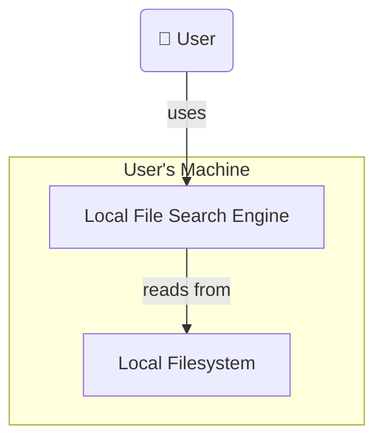
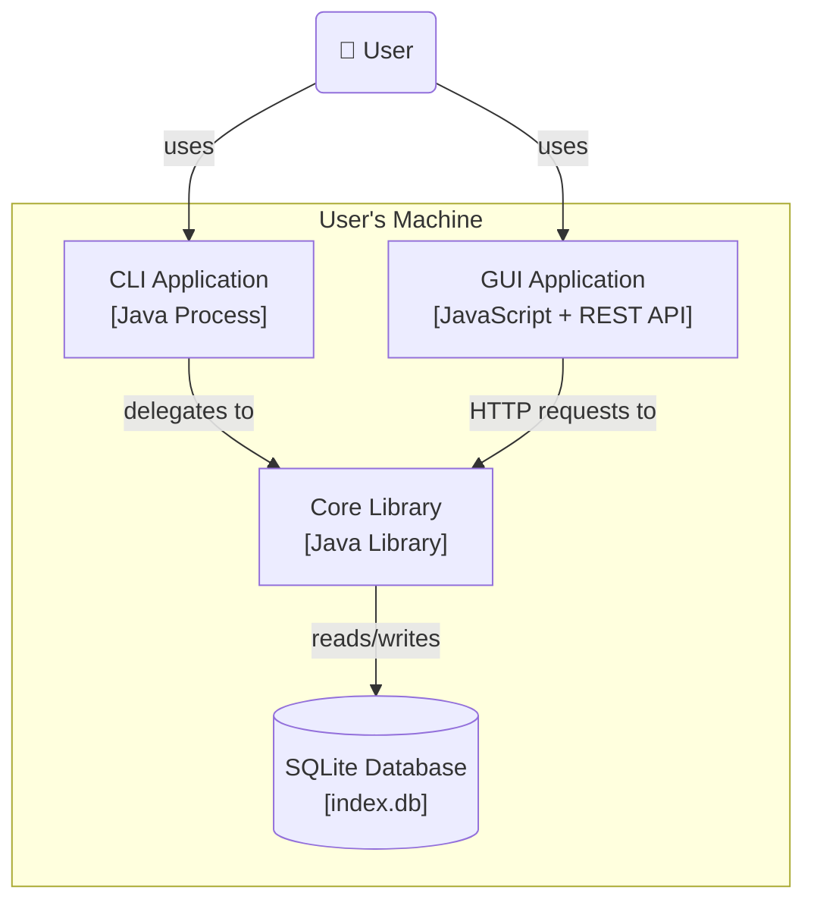
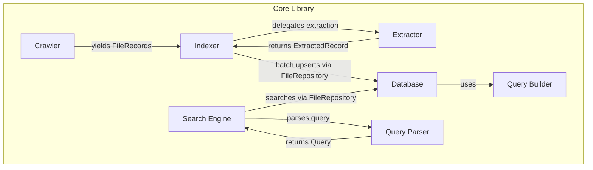
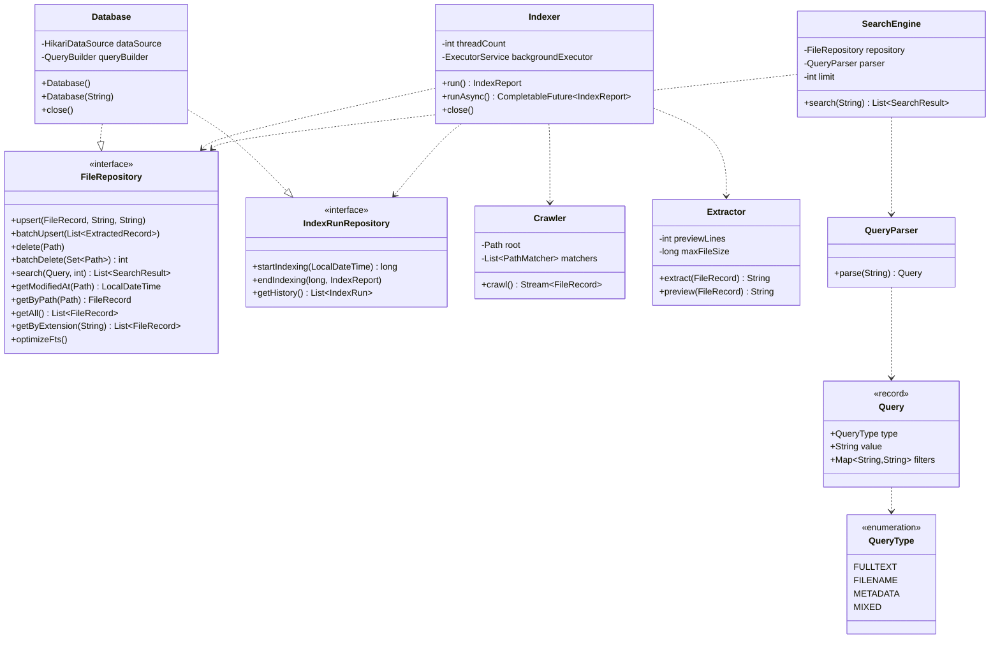

# Local File Search System - Architecture Overview

This document describes the architecture of the Local Search Engine, following the guidelines of the C4 model.
It aims to provide a clear understanding of the system's structure, responsibilities, and boundaries.

---

## 1. System Context (Level 1)

The Local File Search Engine is a tool that runs entirely on the user's machine. It indexes local files and allows the user to search them by filename, content, and metadata. It extracts metadata and content from files, stores them in a database, and provides fast search capabilities with contextual previews.



### Primary Actor

- **User**
Performs search queries, configures runtime options, and views the results.

### External Systems

- **Operating System (Filesystem)**
Provides access to directories, file metadata and content. The search engine relies on the OS for recursive traversal, safe handling of permissions, symbolic links, and file types.

- **Database Management System (DBMS)**
Stores indexed file metadata (size, timestamps, extensions etc.) and full-text content.
SQLite with FTS5 is used as an embedded relational database, avoiding server overhead while supporting efficient full-text search with automatic tokenization and inverted indexing.

### System Responsibilities
- Crawl directories recursively and collect file metadata
- Extract text content from supported file types
- Store metadata and content in the database with full-text indexing
- Execute single and multi-word search queries with metadata filtering
- Generate contextual previews for search results
- Handle errors gracefully (permissions, symlink loops, corrupted files, oversized files)
- Provide a responsive interface for indexing and searching
- Perform incremental indexing by detecting file changes

---

## 2. Containers (Level 2)

The system comprises four containers.



| Container | Technology | Responsibility |
|-----------|------------|----------------|
| **CLI Application** | Java + picocli | Thin frontend — parses commands and arguments, delegates to Core Library, displays results |
| **GUI Application** | JavaScript | Visual frontend for search and results — communicates with Core via a local REST API |
| **Core Library** | Java | All core logic — crawling, indexing, searching, and database access |
| **SQLite Database** | SQLite (FTS5) + HikariCP | Persistent storage of file metadata, full-text content, and indexing history |

---

## 3. Components (Level 3)

This level breaks down the **Core Library** container into its internal components and their relationships.
The Core Library is designed to be independent of any frontend (CLI or GUI).



| Component | Responsibility |
|-----------|----------------|
| **Crawler** | Recursively walks the filesystem, applies default and user-defined glob ignore rules, detects symlink loops, and yields `FileRecord` objects with metadata. Uses `Stream.Builder` for memory-safe streaming |
| **Extractor** | Reads file content with explicit UTF-8 encoding and malformed byte replacement. Enforces a configurable file size limit, throwing `FileTooLargeException` for oversized files. Produces full content and preview strings |
| **Indexer** | Orchestrates the indexing pipeline using a producer-consumer pattern. Parallel threads extract file content and feed a `BlockingQueue`; a single writer thread drains the queue in configurable batches. Implements incremental indexing by comparing `modified_at` timestamps. Tracks progress and generates an `IndexReport`. Supports background execution via `CompletableFuture` |
| **Search Engine** | Accepts raw user query strings, delegates parsing to `QueryParser`, and executes the resulting `Query` against the database with a configurable result limit |
| **Query Parser** | Parses raw user input into typed `Query` objects supporting full-text, filename, metadata, and mixed query types. Uses regex patterns to extract metadata filters (e.g. `ext:java`, `modified:2025-01-01`) |
| **Database** | Implements `FileRepository` and `IndexRunRepository`. Manages a HikariCP connection pool for concurrent read access. Handles schema initialization, all CRUD operations, FTS5 optimization, and index run history |
| **Query Builder** | Builds dynamic SQL queries from `Query` objects, handling FTS5 full-text search, metadata filters, and result limiting. Sanitizes FTS5 special characters to prevent syntax errors |

---

## 4. Classes (Level 4)

This level describes the key classes and interfaces within the Core Library.
This section reflects the current implementation and will evolve in future iterations.

### Class Diagram



### Interfaces

```java
// app/repository/FileRepository.java
interface FileRepository {
    void upsert(FileRecord record, String content, String preview) throws SQLException
    void batchUpsert(List<ExtractedRecord> records) throws SQLException
    void delete(Path path) throws SQLException
    int batchDelete(Set<Path> paths) throws SQLException
    List<SearchResult> search(Query query, int limit) throws SQLException
    LocalDateTime getModifiedAt(Path path) throws SQLException
    FileRecord getByPath(Path path) throws SQLException
    List<FileRecord> getAll() throws SQLException
    List<FileRecord> getByExtension(String extension) throws SQLException
    void optimizeFts() throws SQLException
}

// app/repository/IndexRunRepository.java
interface IndexRunRepository {
    long startIndexing(LocalDateTime startedAt) throws SQLException
    void endIndexing(long runId, IndexReport report) throws SQLException
    List<IndexRun> getHistory() throws SQLException
}
```

### Crawler

```java
// app/crawler/Crawler.java
class Crawler {
    // default ignore rules: node_modules, target, .git, Windows system dirs, etc.
    private static final List<String> DEFAULT_IGNORE_RULES

    Crawler(Path root, List<String> ignoreRules)
    Stream<FileRecord> crawl()                    // throws IllegalArgumentException if root is invalid
    private FileRecord buildRecord(Path file, BasicFileAttributes attrs)
    private boolean isIgnored(Path path)
}
```

### Model

```java
// app/model/FileRecord.java
record FileRecord(
    Path path,
    String filename,
    String extension,
    long sizeBytes,
    LocalDateTime createdAt,
    LocalDateTime modifiedAt
)

// app/model/SearchResult.java
record SearchResult(
    Path path,
    String filename,
    String extension,
    String preview,
    LocalDateTime modifiedAt
)

// app/model/ExtractedRecord.java
record ExtractedRecord(
    FileRecord record,
    String content,
    String preview
)

// app/model/IndexRun.java
record IndexRun(
    long id,
    LocalDateTime startedAt,
    LocalDateTime finishedAt,
    int totalFiles,
    int indexed,
    int skipped,
    int failed,
    int deleted,
    Duration elapsed
)
```

### Extractor

```java
// app/extractor/Extractor.java
class Extractor {
    Extractor()                                   // defaults: 3 preview lines, 10MB max
    Extractor(int previewLines, long maxFileSize)
    String extract(FileRecord record)             // throws FileTooLargeException
    String preview(FileRecord record)             // throws FileTooLargeException
}

// app/extractor/FileTooLargeException.java
class FileTooLargeException extends RuntimeException {
    FileTooLargeException(Path path, long size, long maxSize)
}
```

### Indexer

```java
// app/indexer/Indexer.java
class Indexer implements AutoCloseable {
    Indexer(FileRepository repository, IndexRunRepository indexRunRepository,
            Crawler crawler, Extractor extractor)
    Indexer(FileRepository repository, IndexRunRepository indexRunRepository,
            Crawler crawler, Extractor extractor, int threadCount)
    IndexReport run()                             // blocking
    CompletableFuture<IndexReport> runAsync()     // non-blocking background execution
    void close()                                  // shuts down background executor
}

// app/indexer/IndexReport.java
record IndexReport(
    int totalFiles,
    int indexed,
    int skipped,
    int failed,
    int deleted,
    Duration elapsed
)
```

### Search

```java
// app/search/SearchEngine.java
class SearchEngine {
    SearchEngine(FileRepository repository)
    SearchEngine(FileRepository repository, QueryParser parser, int limit)
    List<SearchResult> search(String input)
}

// app/search/query/QueryParser.java
class QueryParser {
    Query parse(String input)                     // throws IllegalArgumentException if blank
}

// app/search/query/Query.java
record Query(
    QueryType type,
    String value,
    Map<String, String> filters
)

// app/search/query/QueryType.java
enum QueryType { FULLTEXT, FILENAME, METADATA, MIXED }
```

### Database

```java
// app/db/Database.java
class Database implements FileRepository, IndexRunRepository, AutoCloseable {
    Database()                                    // default path: .searchengine/index.db
    Database(String dbPath)
    Database(String dbPath, QueryBuilder queryBuilder)
    void close()                                  // closes HikariCP connection pool
}

// app/db/QueryBuilder.java (package-private)
class QueryBuilder {
    BuiltQuery build(Query query, int limit)
}

// app/db/BuiltQuery.java (package-private)
record BuiltQuery(String sql, List<Object> params)
```

### Utility

```java
// app/util/FileTypes.java
final class FileTypes {
    static final Set<String> TEXT_EXTENSIONS     // whitelist of indexable extensions
    private FileTypes()                           // non-instantiable
}
```

---

## Database Schema

```sql
-- Metadata table
CREATE TABLE IF NOT EXISTS files (
    path        TEXT PRIMARY KEY,
    filename    TEXT NOT NULL,
    extension   TEXT,
    size_bytes  INTEGER,
    created_at  TEXT,
    modified_at TEXT,
    indexed_at  TEXT
);

CREATE INDEX IF NOT EXISTS idx_files_extension ON files(extension);
CREATE INDEX IF NOT EXISTS idx_files_modified_at ON files(modified_at);

-- Full-text search virtual table (FTS5)
-- Automatically maintains an inverted index for fast full-text search
CREATE VIRTUAL TABLE IF NOT EXISTS files_fts USING fts5(
    path        UNINDEXED,
    filename,
    content,
    preview     UNINDEXED
);

-- Indexing history
CREATE TABLE IF NOT EXISTS index_runs (
    id              INTEGER PRIMARY KEY AUTOINCREMENT,
    started_at      TEXT,
    finished_at     TEXT,
    total_files     INTEGER,
    indexed         INTEGER,
    skipped         INTEGER,
    failed          INTEGER,
    deleted         INTEGER,
    elapsed_seconds INTEGER
);
```

---

## Key Design Decisions

- **SQLite + FTS5** — chosen for zero-setup local deployment. FTS5 provides automatic tokenization and inverted indexing, enabling fast full-text search without custom implementation.
- **HikariCP connection pool** — enables concurrent read access from multiple threads while the single writer thread batches writes sequentially, avoiding `SQLITE_BUSY` errors.
- **Producer-consumer indexing** — parallel threads extract file content (I/O bound, benefits from concurrency); a single writer thread batches database writes (SQLite requires sequential writes). A `BlockingQueue` buffers between them.
- **Incremental indexing** — `modified_at` timestamps are compared before extracting content, reducing subsequent index runs from minutes to seconds.
- **`FileRepository` and `IndexRunRepository` interfaces** — `Indexer` and `SearchEngine` depend on abstractions, not on `Database` directly. This enables future database swaps and simplifies testing.
- **`QueryParser` with typed `Query` objects** — separates query parsing from execution. Supports full-text, filename, metadata, and mixed queries with extensible filter syntax (e.g. `ext:java`, `modified:2025-01-01`).
- **Whitelist-based file filtering** — `FileTypes.TEXT_EXTENSIONS` defines indexable file types. Unknown extensions are ignored by default, which is safer than a blacklist approach.
- **`CompletableFuture` for background indexing** — `Indexer.runAsync()` enables non-blocking indexing for the GUI, while `run()` remains available for the CLI which blocks and waits.
