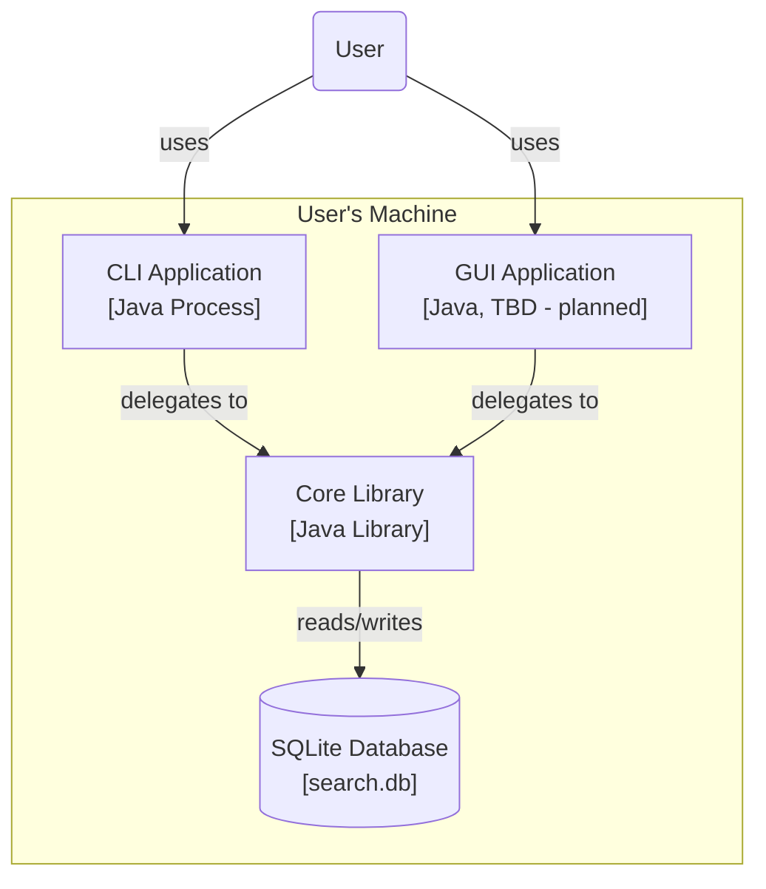

# Local File Search System - Architecture Overview

This document describes the architecture of the Local Search Engine, following the guidelines of the C4 model.
It aims to provide a clear understanding of the system's structure, responsibilities, and boundaries.

## 1. System Context (Level 1)

The Local File Search Engine is a tool that runs on the user's machine. It indexes local files and allows the user to search them by filename, content and metadata. It extracts metadata and content from files, stores them in a database, and provides fast search capabilities with contextual previews.

```
┌──────────────────────────────────────────────────────┐
│                    User's Machine                    │
│                                                      │
│   [User] ──uses──> [Local File Search Engine]        │
│                          │                           │
│                    reads from                        │
│                          │                           │
│                   [Local Filesystem]                 │
└──────────────────────────────────────────────────────┘
```

### Primary Actor

- **User** 
Performs search queries, configures runtime options, and views the results.

### External Systems

- **Operating System (Filesystem)**
Provides access to directories, file metadata and content. The search engine relies on the OS for recusive traversal, safe handling of permissions, symbolic links and file types.

- **Database Management System (DBMS)**
Stores indexed file metadata (size, timestamps, extensions etc.) and contents.
A lightweight, embedded relational database is used, such as SQLite, to avoid server overhead, while supporting efficient full-text search.

### System Responsibilities
- Crawl directories recursively and collect file metadata
- Extract content from supported files
- Store metadata and content in the database
- Execute single and multi-word search queries
- Generate contextual previews for search results
- Handle errors (permissios, symlink loops, corrupted files)
- Provide a responsive interface for indexing and searching

## 2. Containers (Level 2)

The system comprises four containers. 


| Container | Technology | Responsibility |
|-----------|------------|----------------|
| **CLI Application** | Java | Thin frontend — parses commands and arguments, delegates to Core Library, displays results |
| **GUI Application** | TBD *(planned)* | Visual frontend for search and results — design and framework TBD |
| **Core Library** | Java | All core logic — crawling, indexing, searching, and database access |
| **SQLite Database** | SQLite (FTS5) | Persistent storage of file metadata and full-text content |

