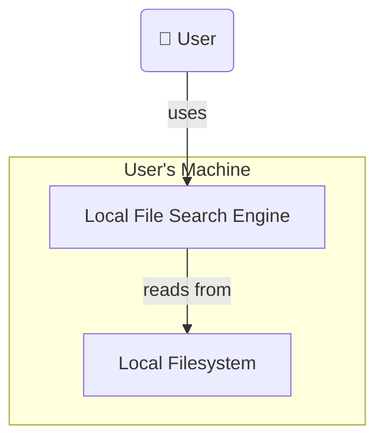
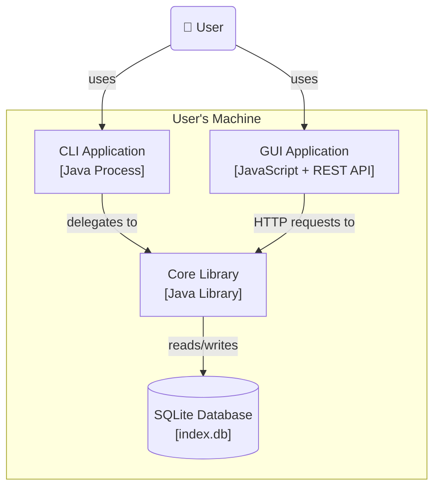
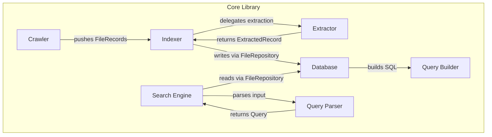
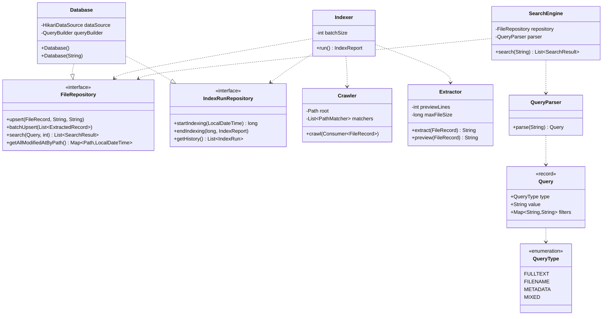

# Local File Search System - Architecture Overview

This document describes the architecture of the Local Search Engine, following the guidelines of the C4 model. It aims to provide a clear understanding of the system's structure, responsibilities, and boundaries.

---

## 1. System Context (Level 1)

The Local File Search Engine is a tool that runs entirely on the user's machine, indexing files and enabling fast content and metadata search.

| Actor / System | Role |
|----------------|------|
| **User** | Performs searches, triggers indexing, configures runtime options |
| **Local Filesystem** | Source of all indexed data — files, metadata, directory structure |
| **SQLite (DBMS)** | Embedded database storing indexed content and metadata |

---

## 2. Containers (Level 2)

| Container | Technology | Responsibility |
|-----------|------------|----------------|
| **CLI Application** | Java + picocli | Parses commands and delegates to Core Library |
| **GUI Application** | JavaScript | Visual frontend communicating with Core via a local REST API |
| **Core Library** | Java | All domain logic — crawling, indexing, searching, and database access |
| **SQLite Database** | SQLite (FTS5) | Persistent storage of file metadata, content, and indexing history |

---

## 3. Components (Level 3)

Components of the **Core Library**. The library is designed to be independent of any frontend.

| Component | Responsibility |
|-----------|----------------|
| **Crawler** | Traverses the filesystem and emits `FileRecord` objects to the indexing flow |
| **Extractor** | Reads file content and produces text and preview strings |
| **Indexer** | Performs incremental checks and batch writes extracted records to storage |
| **Search Engine** | Accepts user queries and returns ranked results |
| **Query Parser** | Translates raw input strings into typed `Query` objects |
| **Database** | Implements `FileRepository` and `IndexRunRepository` — the only component with storage knowledge |
| **Query Builder** | Constructs SQL from `Query` objects, internal to the `db` package |

---

## 4. Classes (Level 4)

Key classes and interfaces. This section reflects the current implementation and will evolve across iterations.

### Model

| Class | Type | Key Fields |
|-------|------|------------|
| `FileRecord` | record | `path`, `filename`, `extension`, `sizeBytes`, `createdAt`, `modifiedAt` |
| `SearchResult` | record | `path`, `filename`, `extension`, `preview`, `modifiedAt` |
| `ExtractedRecord` | record | `record`, `content`, `preview` |
| `IndexReport` | record | `totalFiles`, `indexed`, `skipped`, `failed`, `deleted`, `elapsed` |
| `IndexRun` | record | `id`, `startedAt`, `finishedAt`, `totalFiles`, `indexed`, `elapsed` |
| `QueryType` | enum | `FULLTEXT`, `FILENAME`, `METADATA`, `MIXED` |

## Database

The database contains three logical areas:

- **File metadata** — path, filename, extension, size, timestamps
- **Full-text indexed content** — filename and file content searchable via FTS5
- **Indexing history** — per-run statistics including file counts and elapsed time

---

## Key Design Decisions

- **`FileRepository` and `IndexRunRepository` interfaces** — storage can be swapped without touching business logic
- **`QueryParser`** — query syntax evolves independently of search execution
- **`Crawler`** — traversal strategy changes without affecting the indexing pipeline
- **`Extractor`** — new file types can be supported without changing the indexer
- **SQLite + FTS5** — embedded database with built-in full-text search, no server required
- **GUI via REST API** — frontend is fully decoupled from the Core Library